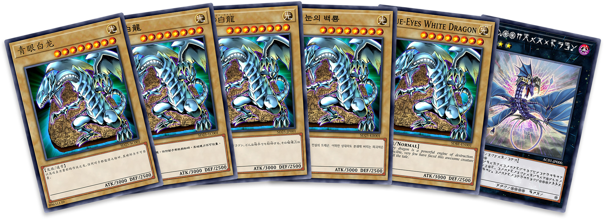

# 游戏王AI卡片生成器

<p align="center">
  <a href="https://www.npmjs.org/package/yugioh-card">
    
  </a>
  <a href="https://www.npmjs.org/package/yugioh-card">
    
  </a>
  <a href="LICENSE">
    
  </a>
</p>

<p align="center">一个使用AI技术生成游戏王卡片的工具</p>

<p align="center">
  
</p>

## ✨ AI卡片生成功能

本项目使用AI技术帮您创建独特的游戏王卡片：

- 🤖 **基于主题自动生成**：只需输入您喜欢的主题（如：龙、魔法师、战士等），AI将为您生成相应的卡片
- 🎭 **多种卡片类型**：支持生成怪兽卡、魔法卡和陷阱卡
- 🌈 **自定义选项**：可选择卡片强度（弱、中、强）和怪兽属性
- 🖼️ **高质量图片**：自动生成与卡片主题相符的精美插图
- 📝 **专业效果文本**：AI撰写符合游戏王风格的卡片效果描述
- 🔄 **一键应用**：将生成结果直接应用到卡片编辑器中进行进一步调整

### 功能优化

1. **移除灵摆召唤**：简化了卡片类型，移除了灵摆召唤相关功能。
2. **语言固定为简体中文**：为提高性能并简化操作，仅支持简体中文。
3. **移除预设功能**：不再支持预设的保存和加载功能。
4. **UI优化**：
   - 标签导航栏文本简化（基本、其它、高级）
   - 美化表单按钮样式
   - 改进卡片预览区域滚动
   - 优化生成图片大小
5. **性能优化**：
   - 使用jsDelivr CDN加速静态资源加载
   - 代码分块和懒加载提升首次加载速度
   - 优化卡片渲染性能和内存占用

### 使用说明

1. 在"基本"标签页中设置卡片基本信息（如卡名、卡片类型等）
2. 使用AI功能根据主题自动生成卡片内容
3. 调整生成内容满意后可导出图片

## 🚀 在线演示

[在线演示](https://dasen199.github.io/yugioh-card/)

## 🚄 CDN加速 

本项目使用jsDelivr提供CDN加速，加快网站加载速度：

```js
// 在生产环境中使用jsDelivr CDN加载静态资源
const resourcePath = process.env.NODE_ENV === 'production' 
  ? 'https://cdn.jsdelivr.net/gh/Dasen199/yugioh-card@master/src/assets/yugioh-card'
  : 'src/assets/yugioh-card';

// 使用CDN加载的第三方库
// - Vue
// - Element Plus
// - Element Plus Icons
```

开发者可以通过以下命令构建使用CDN加速的版本：

```bash
# 安装依赖
npm install

# 构建CDN加速版本
npm run build:cdn
```

## ⚡ 快速开始

`npm i yugioh-card`

```js
// 可选 YugiohCard, YugiohBackCard
import { YugiohCard } from 'yugioh-card';

const card = new YugiohCard({
  view: 'xxx', // div 容器
  data: {
    ..., // 参数见下方 Data 属性
  },
  resourcePath: 'xxx', // 静态资源路径，把 src/assets/yugioh-card 文件夹复制到你的项目中或者服务器上
});

// 导出图片，更多导出参数请参考 https://www.leaferjs.com/ui/guide/export/
card.leafer.export('xxx.png');
```

## 🔎 示例代码

[示例代码](src/components/YugiohCard.vue)

## 📖 Data 属性

### 游戏王

|         属性名         |    说明     |   类型    |                                                         可选值                                                         |                   备注                    |        默认值        |
|:-------------------:|:---------:|:-------:|:-------------------------------------------------------------------------------------------------------------------:|:---------------------------------------:|:-----------------:|
|      language       |    语言     |  enum   |                                     'sc' / 'tc' / 'jp' / 'kr' / 'en' / 'astral'                                     |    简体中文 / 繁体中文 / 日文 / 韩文 / 英文 / 星光界文    |       'sc'        |
|        font         |    字体     |  enum   |                                             '' / 'custom1' / 'custom2'                                              |          默认 / 华康隶书体 / 文鼎中粗隶简繁           |        ''         |
|        name         |    卡名     | string  |                                                          —                                                          |                    —                    |        ''         |
|        color        |   卡名颜色    | string  |                                                          —                                                          |                    —                    |        ''         |
|        align        |   卡名对齐    |  enum   |                                             'left' / 'center' / 'right'                                             |             左对齐 / 居中 / 右对齐              |      'left'       |
|      gradient       |  卡名是否渐变色  | boolean |                                                          —                                                          |                    —                    |       false       |
|   gradientColor1    |   渐变色 1   | string  |                                                          —                                                          |                    —                    |     '#999999'     |
|   gradientColor2    |   渐变色 2   | string  |                                                          —                                                          |                    —                    |     '#ffffff'     |
|        type         |    类型     |  enum   |                                      'monster' / 'spell' / 'trap' / 'pendulum'                                      |            怪兽 / 魔法 / 陷阱 / 灵摆            |     'monster'     |
|      attribute      |    属性     |  enum   |                       'dark' / 'light' / 'earth' / 'water' / 'fire' / 'wind' / 'divine' / ''                        |      暗 / 光 / 地 / 水 / 炎 / 风 / 神 / 无      |      'dark'       |
|        icon         |   魔陷图标    |  enum   |                       'equip' / 'field' / 'quick-play' / 'ritual' / 'continuous' / 'counter'                        |       装备 / 场地 / 速攻 / 仪式 / 永续 / 反击       |        ''         |
|        image        |   中间卡图    | string  |                                                          —                                                          |                    —                    |        ''         |
|      cardType       |   卡片类型    |  enum   |                  'normal' / 'effect' / 'ritual' / 'fusion' / 'synchro' / 'xyz' / 'link' / 'token'                   | 通常 / 效果 / 仪式 / 融合 / 同调 / 超量 / 连接 / 衍生物  |     'normal'      |
|    pendulumType     |   灵摆类型    |  enum   | 'normal-pendulum' / 'effect-pendulum' / 'ritual-pendulum' / 'fusion-pendulum' / 'synchro-pendulum' / 'xyz-pendulum' | 通常灵摆 / 效果灵摆 / 仪式灵摆 / 融合灵摆 / 同调灵摆 / 超量灵摆 | 'normal-pendulum' |
|        level        |    星级     | number  |                                                          —                                                          |                    —                    |         0         |
|        rank         |    阶级     | number  |                                                          —                                                          |                    —                    |         0         |
|    pendulumScale    |   灵摆刻度    | number  |                                                          —                                                          |                    —                    |         0         |
| pendulumDescription |   灵摆效果    | string  |                                                          —                                                          |                    —                    |        ''         |
|     monsterType     |   怪兽类型    | string  |                                                          —                                                          |                    —                    |        ''         |
|       atkBar        |    攻守条    | boolean |                                                          —                                                          |                    —                    |       true        |
|         atk         |    攻击力    | number  |                                                          —                                                          |                ?：-1，∞：-2                |         0         |
|         def         |    防御力    | number  |                                                          —                                                          |                ?：-1，∞：-2                |         0         |
|      arrowList      |   连接箭头    |  array  |                                              [1, 2, 3, 4, 5, 6, 7, 8]                                               |      [上, 右上, 右, 右下, 下, 左下, 左, 左上]       |        []         |
|     description     |   效果描述    | string  |                                                          —                                                          |                    —                    |        ''         |
|  firstLineCompress  |  是否首行压缩   | boolean |                                                          —                                                          |                    —                    |       false       |
|  descriptionAlign   | 是否效果描述居中  | boolean |                                                          —                                                          |                    —                    |       false       |
|   descriptionZoom   |  效果描述缩放   | number  |                                                          —                                                          |                    —                    |         1         |
|  descriptionWeight  |  效果描述字重   | number  |                                                          —                                                          |                    —                    |         0         |
|       package       |    卡包     | string  |                                                          —                                                          |                    —                    |        ''         |
|      password       |   卡片密码    | string  |                                                          —                                                          |                    —                    |        ''         |
|      copyright      |    版权     |  enum   |                                                 'sc' / 'jp' / 'en'                                                  |             简体中文 / 日文 / 英文              |        ''         |
|        laser        |    角标     |  enum   |                                      'laser1' / 'laser2' / 'laser3' / 'laser4'                                      |          样式一 / 样式二 / 样式三 / 样式四          |        ''         |
|        rare         |    罕贵     |  enum   |                                 'dt' / 'ur' / 'gr' / 'hr' / 'ser' / 'gser' / 'pser'                                 |  DT / UR / GR / HR / SER / GSER / PSER  |        ''         |
|      twentieth      | 是否是 20 周年 | boolean |                                                          —                                                          |                    —                    |       false       |
|       radius        |   是否是圆角   | boolean |                                                          —                                                          |                    —                    |       true        |
|        scale        |   卡片缩放    | number  |                                                          —                                                          |                    —                    |         1         |

### 游戏王卡背

|   属性名    |   说明    |   类型    |                           可选值                           |          备注          |   默认值    |
|:--------:|:-------:|:-------:|:-------------------------------------------------------:|:--------------------:|:--------:|
|   type   |  卡背类型   |  enum   | 'normal' / 'tormentor' / 'sky-dragon' / 'winged-dragon' | 通常 / 巨神兵 / 天空龙 / 翼神龙 | 'normal' |
|   logo   |   标志    |  enum   |                  'ocg' / 'tcg' / 'rd'                   |    OCG / TCG / RD    |  'ocg'   |
|  konami  | 是否有 K 标 | boolean |                            —                            |          —           |   true   |
| register | 是否有 R 标 | boolean |                            —                            |          —           |   true   |
|  radius  |  是否是圆角  | boolean |                            —                            |          —           |   true   |
|  scale   |  卡片缩放   | number  |                            —                            |          —           |    1     |
